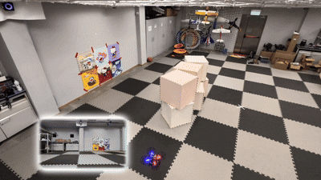

<div align="center">
    <!-- <h1>FlyCo</h1> -->
    <h2>FC-Vision: Real-Time Visibility-Aware Replanning for Occlusion-Free Aerial Target Structure Scanning in Unknown Environments</h2>
    <strong>RA-L 2026</strong>
    <br>
        <a href="https://chen-albert-feng.github.io/AlbertFeng.github.io/" target="_blank">Chen Feng</a><sup></sup>,
        Yang Xu, and
        <a href="https://uav.hkust.edu.hk/group/" target="_blank">Shaojie Shen</a><sup></sup>
    <p>
        <h45>
            HKUST Aerial Robotics Group
            <br>
        </h5>
    </p>
    <a href='https://arxiv.org/pdf/2602.13720'></a>
    <!-- <a href='https://hkust-aerial-robotics.github.io/FC-Planner/'></a> -->
    <a href="https://www.youtube.com/watch?v=H3C42zlDOAI"></a>
</div>

## 📢 News

* **[29/08/2026]**: The released FC-Vision codebase and development environment setup are now available.
* **[16/06/2026]**: FC-Vision is accepted to RA-L. The source code is coming soon!

## 📜 Introduction

This repository maintains the implementation of "FC-Vision: Real-Time Visibility-Aware Replanning for Occlusion-Free Aerial Target Structure Scanning in Unknown Environments", owned by [Chen Feng](https://chen-albert-feng.github.io/AlbertFeng.github.io/).

<p align="center">
  
</p>

**FC-Vision** is a real-time visibility-aware replanning framework that advances UAVs to perform occlusion-free target scanning in unknown environments while maintaining safe and efficient flight, simple yet effective.

<p align="center">
  
  
</p>

Please cite our paper if you use this project in your research:

```
@article{feng2026fc,
  title={FC-Vision: Real-Time Visibility-Aware Replanning for Occlusion-Free Aerial Target Structure Scanning in Unknown Environments},
  author={Feng, Chen and Xu, Yang and Shen, Shaojie},
  journal={IEEE Robotics and Automation Letters},
  year={2026},
  publisher={IEEE}
}
```

**License Notice**: This project is released under the PolyForm Noncommercial License 1.0.0 and is intended for non-commercial use only; commercial use is not permitted without explicit permission from the copyright owners. Please see [LICENSE](LICENSE) for details.

Please kindly star ⭐️ this project if it helps you. We take great efforts to develop and maintain it 😁.

## 🛠️ Installation

**Prerequisite:**
* ROS Noetic (Ubuntu 20.04)
* PCL 1.10
* [Eigen 3.4.1](https://hkustconnect-my.sharepoint.com/:u:/g/personal/cfengag_connect_ust_hk/ES7krJtO3E1Oh4wY0-Wcr-gBDZ3dWz9bpbFNKp6Yhpn3Yg?e=mfiKrO)
* Trajectory Optimization
```shell
  sudo apt update
  sudo apt install cpufrequtils
  sudo apt install libompl-dev
```
* AirSim Simulator
```
  git clone -b 4.25 git@github.com:EpicGames/UnrealEngine.git
  cd UnrealEngine
  ./Setup.sh
  ./GenerateProjectFiles.sh
  make

  git clone https://github.com/Microsoft/AirSim.git
  cd AirSim
  ./setup.sh
  ./build.sh
```
Modify your ```~/Documents/AirSim/settings.json``` as the same as [setting.json](./script/setting/settings.json) and download the UE simulation environments from [Google Drive](https://drive.google.com/drive/folders/1U7slhtakIY3R8oK34_FUbCEG9s9qyByi?usp=sharing).

**Compilation:**
```shell
  catkin_make --cmake-args -Wno-dev
```

If you have installed ***Anaconda*** or ***Miniconda***, please use ``catkin_make --cmake-args -Wno-dev -DPYTHON_EXECUTABLE=/usr/bin/python3``.

## 🚀 Quick Start

* Change UE path in your machine

You should change ```UPROJECT``` and ```UE4_EDITOR``` with your own path in ```./run_${DEMO_SCENARIO}.sh``` from [script](./script/).

* Start the full stack

```shell
cd script && ./run_${DEMO_SCENARIO}.sh
```

where ```${DEMO_SCENARIO}``` is ```east_church```, ```kino_wall```, or ```tunnel```.

* Stop all services

```shell
cd script && ./kill_demo.sh
```

## 🤗 FC-Family Works

#### 1. What is [FC-Family](https://github.com/FC-Family)?

We aim to develop intelligent active perception flight to realize ***F***ast and reliable ***C***overage / s***C***anning / re***C***onstruction / inspe***C***tion etc.

#### 2. Projects list

* [PredRecon](https://github.com/HKUST-Aerial-Robotics/PredRecon) (ICRA2023): Prediction-boosted Planner for Aerial Reconstruction.
* [FC-Planner](https://github.com/HKUST-Aerial-Robotics/FC-Planner) (ICRA2024): Highly Efficient Global Planner for Aerial Coverage.
* [SOAR](https://github.com/SYSU-STAR/SOAR) (IROS2024): Heterogenous Multi-UAV Planner for Aerial Reconstruction.
* [FC-Vision](https://github.com/FC-Family/FC-Vision) (RA-L2026): Online Visibility-aware Replanning for Occlusion-free Aerial Scanning.
* [FlyCo](https://github.com/FC-Family/FlyCo): Complete and Prompt-Driven System for Open-World Aerial 3D Structure Scanning.
